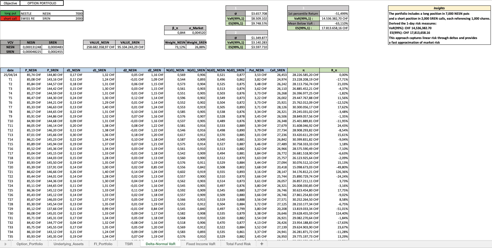
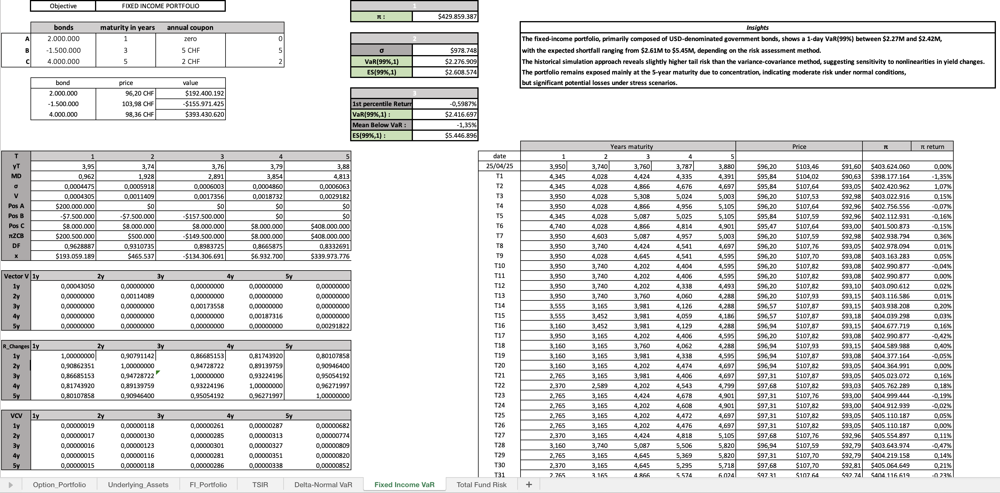
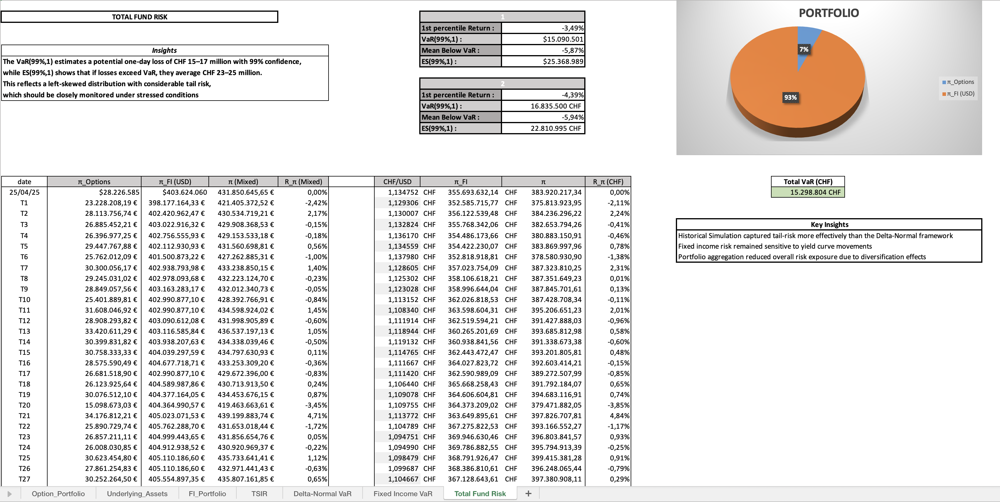

# Multi-Asset VaR and Expected Shortfall Analysis

Multi-asset portfolio risk analytics project focused on equity options, fixed income risk, Value-at-Risk, Expected Shortfall, historical simulation and fund-level risk aggregation.

---

## Project Overview

This project presents a comprehensive multi-asset risk analysis across an equity option portfolio and a USD-denominated fixed income portfolio.

The objective is to compare how different quantitative risk methodologies estimate downside exposure, tail risk and total fund risk under alternative modeling assumptions.

The analysis combines:
- Delta-Normal / Asset-Normal VaR
- Expected Shortfall estimation
- SMI market beta mapping
- Historical simulation
- Fixed income bond pricing
- Yield curve risk modeling
- CHF-adjusted total fund risk aggregation

---

## Portfolio Structure

The total fund is composed of two main risk blocks:

| Portfolio Component | Description |
|---|---|
| Equity Option Portfolio | Long Nestlé put options and short Swiss Re call options |
| Fixed Income Portfolio | USD-denominated U.S. government bond portfolio |

The final analysis aggregates both portfolios into a CHF-denominated total fund risk framework.

---

## Equity Option Risk Modeling

The equity option portfolio was analyzed using three different methodologies:

| Methodology | Purpose |
|---|---|
| Delta-Normal VaR | Approximate option risk using monetary delta exposure |
| SMI-Mapped VaR | Estimate systematic market risk through beta-adjusted SMI exposure |
| Historical Simulation | Revalue the option portfolio under historical return scenarios |



---

## Fixed Income Risk Modeling

The fixed income portfolio was priced by discounting future bond cash flows using the zero-coupon yield curve as of April 25, 2025.

The portfolio risk was then estimated through:
- cash-flow mapping across maturity buckets,
- yield variance-covariance modeling,
- and historical simulation of yield curve shifts.



---

## Total Fund Risk Aggregation

The final stage aggregates the equity option and fixed income portfolios into a single CHF-denominated risk framework.

The analysis accounts for:
- multi-asset exposure,
- USD-denominated bond positions,
- CHF/USD conversion,
- portfolio-level VaR,
- Expected Shortfall,
- and historical downside scenarios.



---

## Key Results

### Equity Option Portfolio

| Methodology | VaR(99%, 1-day) | ES(99%, 1-day) |
|---|---:|---:|
| Delta-Normal VaR | CHF 8,509,102 | CHF 9,748,576 |
| SMI-Mapped VaR | CHF 3,140,283 | CHF 3,597,710 |
| Historical Simulation | CHF 14,536,821 | CHF 17,813,658 |

Historical Simulation produced the highest risk estimate, reflecting the importance of capturing option non-linearity, fat tails and historical stress scenarios.

### Fixed Income Portfolio

| Methodology | VaR(99%, 1-day) | ES(99%, 1-day) |
|---|---:|---:|
| Delta-Normal VaR | USD 2,276,909 | USD 2,608,574 |
| Historical Simulation | USD 2,416,697 | USD 5,446,896 |

The materially higher Expected Shortfall under Historical Simulation highlights the portfolio’s exposure to extreme yield curve movements.

### Total Fund Risk

| Scenario | VaR(99%, 1-day) | ES(99%, 1-day) |
|---|---:|---:|
| Conservative Estimate | CHF 15,090,501 | CHF 25,368,989 |
| Historical Simulation | CHF 16,835,500 | CHF 22,810,995 |

The results show that total fund risk remains broadly stable across aggregation approaches, while historical methods provide a more realistic view of downside exposure under stressed conditions.

---

## Key Insights

- Historical Simulation captures tail risk more effectively than Delta-Normal methodologies.
- SMI mapping provides a useful estimate of systematic exposure, but materially underestimates option-specific and nonlinear risks.
- Fixed income risk is mainly driven by yield curve movements and maturity bucket exposure.
- Expected Shortfall is particularly important because it captures the severity of losses beyond the VaR threshold.
- Currency conversion has limited impact on total fund risk relative to the underlying equity option and fixed income exposures.
- Model selection materially affects reported risk and should be carefully evaluated in institutional risk reporting.

---

## Repository Structure

```text
multi-asset-var-and-expected-shortfall-analysis/
│
├── excel-model/
│   ├── multi-asset-risk-analytics-model.xlsx
│   ├── delta-normal-var-model.png
│   ├── fixed-income-risk-model.png
│   └── total-fund-risk-analysis.png
│
├── executive-summary/
│   └── executive-summary.pdf
│
├── presentation/
│   └── multi-asset-risk-analysis-presentation.pdf
│
└── README.md
```

---

## Files Included

| File | Description |
|---|---|
| `multi-asset-risk-analytics-model.xlsx` | Full Excel-based risk model with portfolio data, calculations, scenario analysis and risk outputs |
| `executive-summary.pdf` | Professional summary of methodology, results and key findings |
| `multi-asset-risk-analysis-presentation.pdf` | Final presentation of the multi-asset risk analysis |

---

## Methodologies Implemented

| Methodology | Application |
|---|---|
| Delta-Normal VaR | Equity option and fixed income risk approximation |
| Expected Shortfall | Tail-loss severity estimation |
| Market Beta Mapping | SMI-based systematic risk estimation |
| Historical Simulation | Empirical downside scenario analysis |
| Cash-Flow Mapping | Fixed income maturity bucket risk modeling |
| Yield Curve Repricing | Bond portfolio valuation under rate shocks |
| Fund-Level Aggregation | CHF-adjusted total portfolio risk reporting |

---

## Real-World Applications

The methodologies implemented in this project are relevant for:

- Market risk teams
- Investment banks
- Hedge funds
- Portfolio management divisions
- Fixed income desks
- Equity derivatives teams
- Risk reporting and regulatory capital analysis

The project demonstrates how multi-asset risk models can support more informed portfolio monitoring, downside risk estimation and institutional risk management decisions.

---

## Objective

The project aims to demonstrate how quantitative risk management tools can be used to measure, compare and interpret downside risk across different asset classes.

By combining equity derivatives, fixed income instruments, historical simulation and fund-level aggregation, the analysis provides a practical framework for assessing market risk in a realistic institutional portfolio context.
